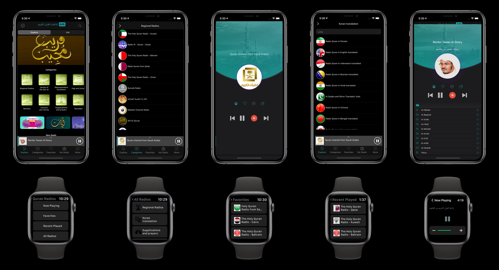
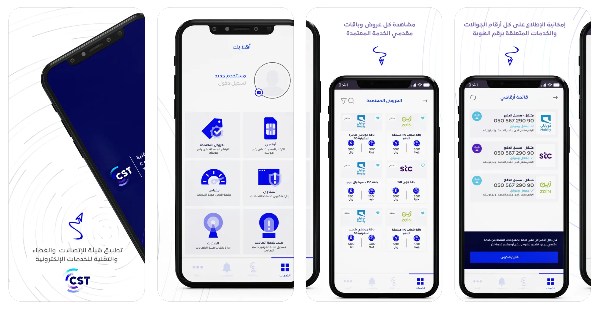
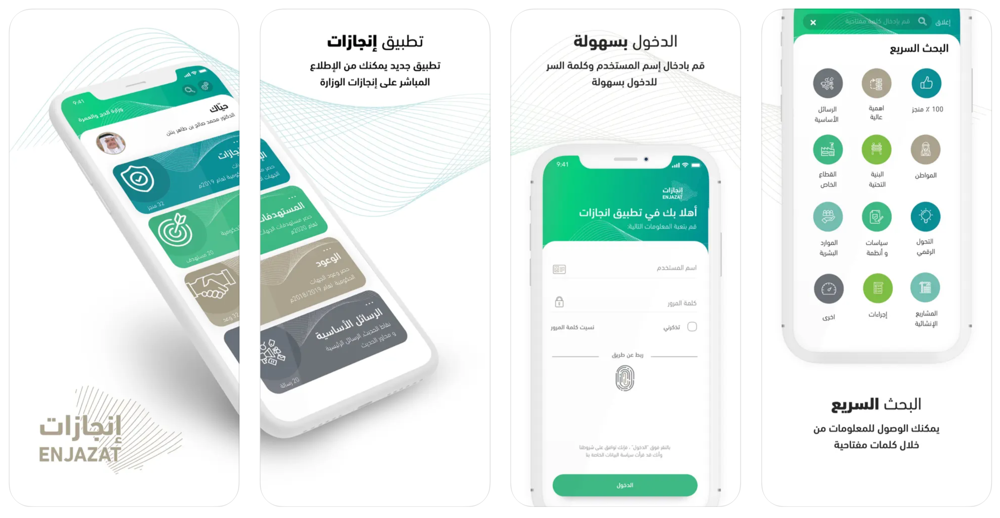
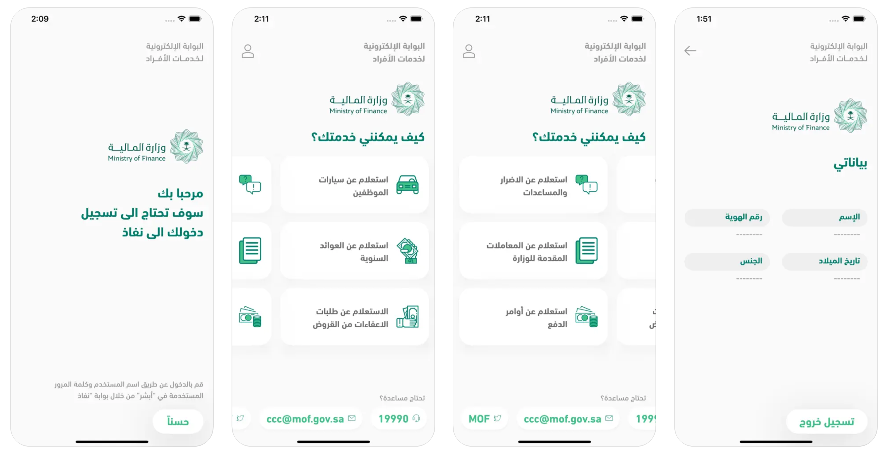
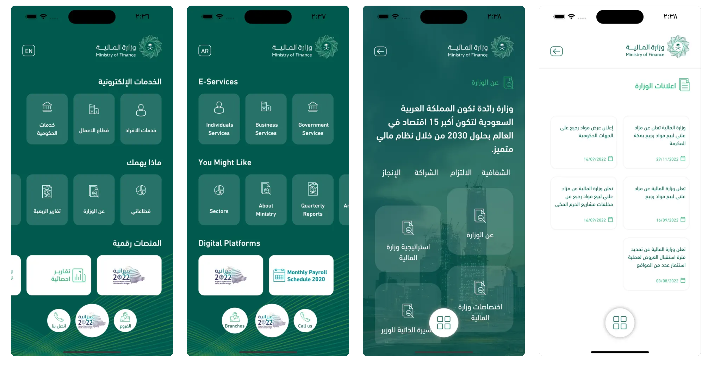
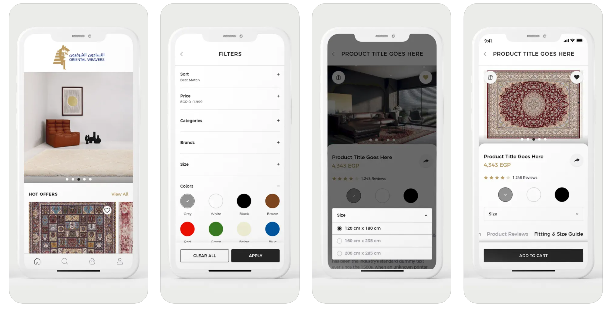
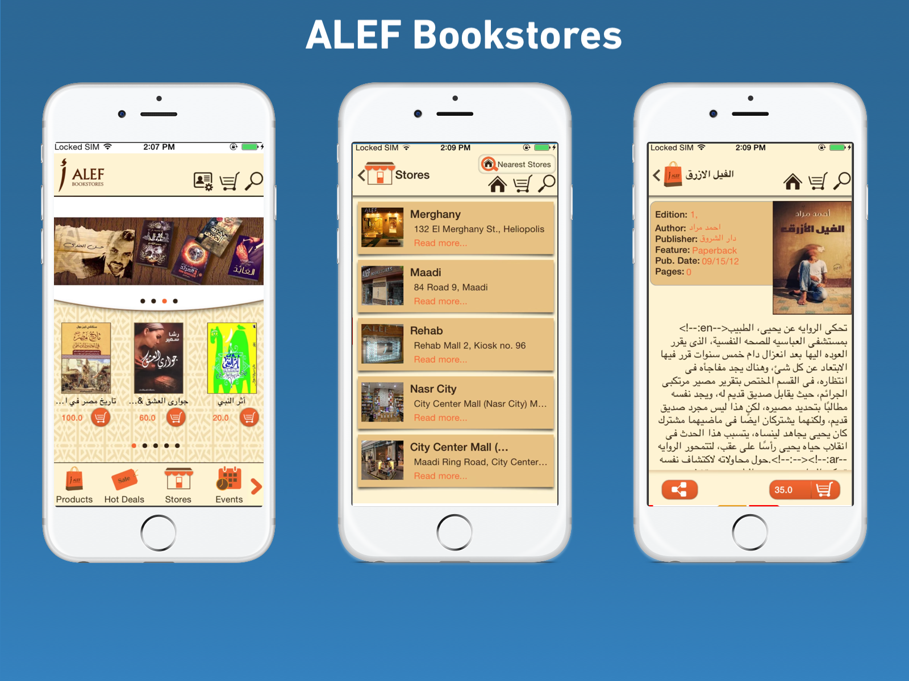
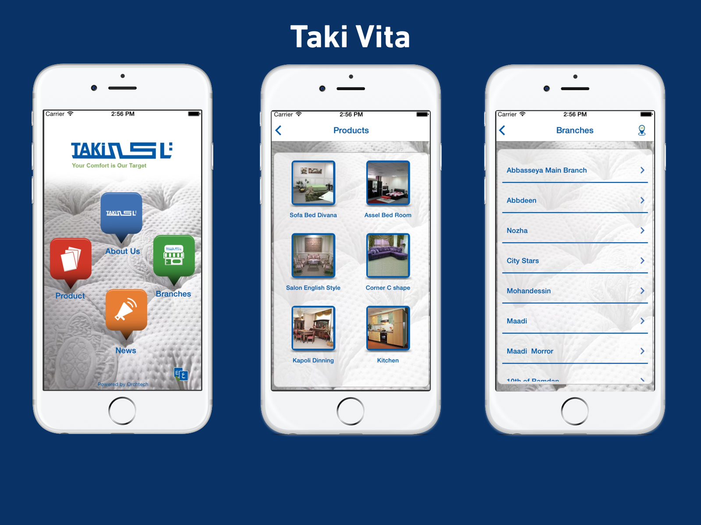

## Quran Radios
[Quran Radios](https://quranrad.io/) Quran Radio is an application that offers live broadcasts for all Quran radio stations in the Islamic world for all famous readers.
- More than 700 radio stations
- It’s the only application that includes Quran broadcasts from Saudi Arabia, Cairo, Bahrain, Kuwait, Emirates, Qatar, and Palestine
- 24/7 broadcasts
- Live recording option
- Ability to listen to recordings without an internet connection
- A timer to automatically stop the radio after a specified time
- The application runs even if closed.
- The ability to share the recordings on social networks
- Search option in the list of radio stations
- The application is easy to use even for seniors

◉Available languages ◉
Arabic, English, French, Urdu, Chinese, Russian, Malay, Indonesian

##### 🔨Technologies: Swift, MVP, Alamofire, Core Data, REST API, In-App Purchase, Unit Tests, AV player, Recording, Push Notifications.
##### 🚀Platform: 📱iOS, iPad,  ⌚️watchOS, TVOS

## CITC
[CITC](https://www.cst.gov.sa/en/Pages/default.aspx) Communications, Space & Technology Commission’s Mobile Application of e-services provided to the public , Through it can use several services, like:

Argami : Allows you to view all the mobile numbers and services registered on your ID.

Complaints: You can submit and follow up a complaints related to the service provider.

Approved Offers: Allows you to know the details of approved offers of all service providers.

Meqyas: You can measure the performance of your network with accurate, detailed measures.

Reports: through which you can inform CITC of any disturbing use or emergency breakdown of telecommunications service providers.

Providing Telecommunication services request service: A service that allows users to inquire available services at a specific location, with the ability to submit a request of unavailable services.

##### 🔨Technologies: Swift, Alamofire, MVP, Maps navigations, Push Notifications.
##### 🚀Platform: 📱iOS, iPad

## Enjazat | إنجازات
[Enjazat](https://apps.apple.com/sa/app/enjazat-إنجازات/id1487726158) is an app that provides an initiative to list the achievements of government agencies inside Saudi Arabia.

##### 🔨Technologies: Swift, Charts, Push Notifications.
##### 🚀Platform: 📱iOS

## Elezaby
[Elezaby](https://apps.apple.com/sa/app/elezaby/id1528993866) El Ezaby pharmacies mobile application is your "to go" portal for all your medical, cosmetics, and health needs.

El Ezaby pharmacies mobile application offers:
- Home Delivery.
- Online Payment.
- More than 11,000 products.
- Detailed products' descriptions.
- Online Medical insurance's prescriptions cash out.
- Online Products' availability checking.
- Scanning the product's bar code from your mobile's camera to make sure it's available.

##### 🔨Technologies: Swift, Objective-C, Maps navigation, Push Notifications, Purchasing, Camera Scanning.
##### 🚀Platform: 📱iOS

## Application of the Ministry of Finance for individuals
[MOF individuals portal](https://apps.apple.com/sa/app/تطبيق-وزارة-المالية-للافراد/id1507806314) The digital services of the Ministry of Finance for citizens and residents, through which they can benefit from the services provided after logging in through the Absher account to benefit from some of the services provided by the Ministry to individuals.
- Inquire about assistance
- Inquiry about livestock aid
- Inquire about natural disaster assistance
- Inquire about aid for the displaced
- Raising the justifications for disbursing annual returns
- Updating the name of the beneficiary of the annual returns
- Update the mobile number of the beneficiary of the annual returns
- Updating the IBAN number of the annual returns beneficiary

##### 🔨Technologies: Flutter, Push Notifications.
##### 🚀Platform: 📱iOS, iPad, Android.

## MOF Public Portal
[MOF Public Portal](https://apps.apple.com/sa/app/بوابة-وزارة-المالية/id1148971973) In view of the importance of the content that the Ministry of Finance provides on the external electronic portal, and in continuation of the Ministry's permanent work to save the time of the beneficiaries of its services, it has provided some of its contents in the external portal on smart devices, in order to ensure its access to all users from anywhere, and given its constant endeavor To cover all the requirements of users, the idea came to provide some content on smart devices, which enables the wide segment that uses smart devices a lot to access it on their devices directly and easily, and the application can access the information they seek, which makes the features provided in the application available around the clock and Very easily and quickly, this document will describe the requirements for the application of smart devices for the Ministry of Finance.

##### 🔨Technologies: Flutter, Push Notifications.
##### 🚀Platform: 📱iOS, iPad, Android.

## Oriental Weavers
[Oriental Weavers](https://shop.orientalweavers.com/en) The Oriental Weavers Group is one of the world’s largest carpets & rugs producers. Based in Cairo, the Group has manufacturing facilities in the United States & Egypt with products sold in more than 130 countries worldwide.

Dedicated to innovation, inspired by consumer insight, and crafted to perfection, the Oriental Weavers Group produces with a passion for value and happiness.

Oriental Weavers now presents an interactive E-Commerce App to all its customers, offering different online payment methods, door to door delivery, and wedding list sharing.

##### 🔨Technologies: Swift, Objective-C, AR, Maps navigation, Push Notifications, Purchasing.
##### 🚀Platform: 📱iOS, iPad

## Azkar & Prayer time - أذكار و اوقات الصلاة
[Azkar & Prayer Time](https://apps.apple.com/sa/app/أذكار-و-اوقات-الصلاة/id550919049) is one of the first applications in the software store and the easiest to use, as it contains all remembrances and supplications from the Qur’an and Sunnah, prayer times and the direction of the qiblah

You will find pleasure in navigating between the supplications, as you will find supplications for every occasion and event with ease.
The application contains a counter that helps to keep track of the remembrance of the Sunnah dhikr.
You can customize the alarm to remind you of a date for morning and evening remembrances.
The application allows the sharing of dhikr and supplications through social networking sites.

##### 🔨Technologies: Swift, AV Player, Widgets, Push Notifications.
##### 🚀Platform: 📱iOS, iPad

## ALEF Bookstores
[ALEF Bookstores](https://www.alef-bookstore-maximmall.com) ALEF’s mission is to create highly knowledgeable, intellectual, and well-read Arab communities throughout the world by developing a clearer understanding of customer needs and by providing customers with a combination of knowledge-propagating media. ALEF aims at creating the biggest online store, providing a professional service that allows customers to go through the books and to buy easily from our online store.

##### 🔨Technologies: Objective-C, Maps, Push Notifications.
##### 🚀Platform: 📱iOS, iPad

## ElMoez Street
[ElMoez Street](https://apps.apple.com/sa/app/elmoez-street/id948171223) El moez street AR application, will help the tourist to be familiar with the places in el moez street like mosques, Sabeels, etc..

All the user has to do is to download the application at their smart phones and detect the place and all the information will be a available at his screen by GPS or Augmented Reality.

This idea will be easily replicate in many sites in Egypt; especially we have a lot of open museums in Egypt like in Luxor and Aswan

##### 🔨Technologies: Objective-C,AR,Rest Api, Push Notifications.
##### 🚀Platform: 📱iOS, iPad.

## Taki Vita
[Taki Vita](https://apps.apple.com/sa/app/taki-vita/id899122873) TAKI’s Mother CO. was Established in 1960 and Taki Vita Co. under the investment law 1976.with 60% Egyptian shares and 40% British shares. However, today 100% of the shares are Egyptian and it is the largest foam and mattresses manufacturer in Egypt and Middle East, and started car seat manufacturing 1997.

##### 🔨Technologies: Objective-C, Rest Api, Push Notifications, Google Maps.
##### 🚀Platform: 📱iOS,iPad

*Unfortunately i can't list all apps that achieved in my last ten years because there are apps that removed from AppStore by clients and many in-house applications.*
